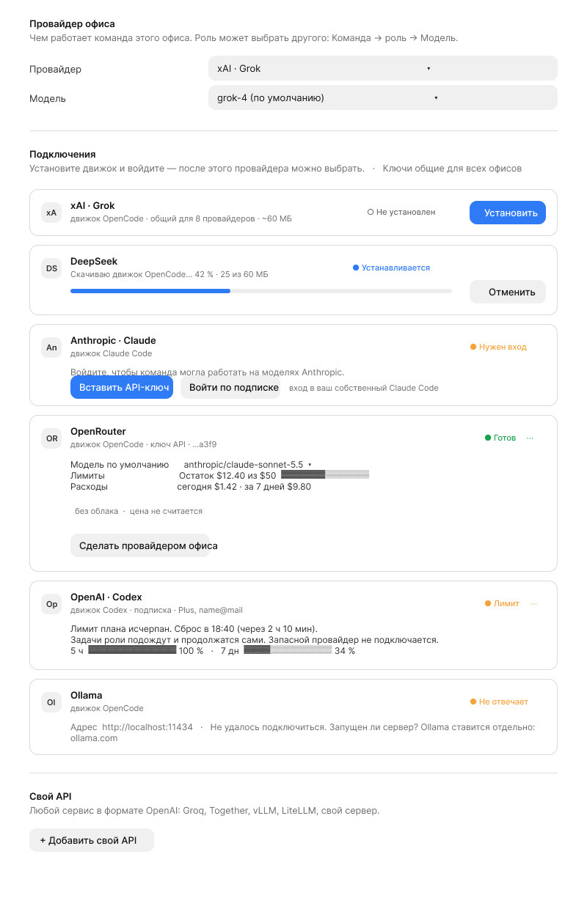
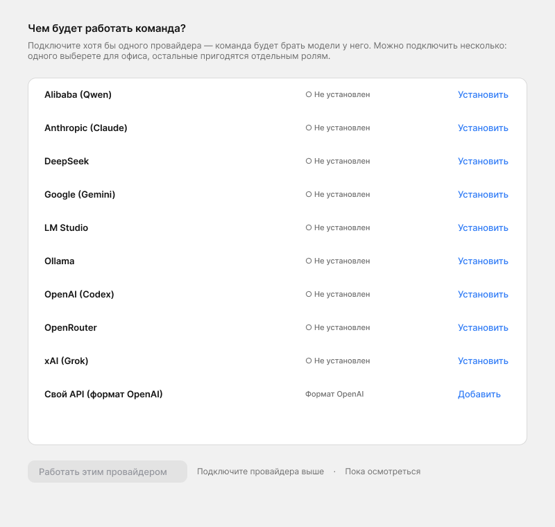

# Экран «Провайдеры» и первый запуск: макет (T-189)

Основа: `docs/design/providers/spec.md` (T-188: провайдеры, движки, `ProviderStatus`,
`ModelChoice`, `Settings.model`, `Role.provider?/model?`). Вёрстка — единый шаблон
вкладок из `docs/design/settings-layout/spec.md` (T-181): `.form`, `.form-section`,
`.form-row`, `.form-hint`. Кит — `kit.css` (`.card`, `.chip`, `.seg`, поля, кнопки),
токены — `tokens.css`. **Новых цветов и токенов нет.**

Код в задаче не меняется. Схемы в Figma (файл «Office», страница «Office», фреймы «T-189 · …» правее
основной сцены, x≈20000) и снимки рядом: `providers-tab.png` (вкладка со всеми
состояниями карточек) и `first-launch.png` (первый запуск). Это схемы раскладки на
токенах кита, не пиксель-перфект; если расходятся с текстом — прав этот документ.
Файл лежит в папке задачи T-189; по постановке результат также ожидался в
`docs/design/providers/ui.md` — при слиянии перенести или сослаться.




## 0. Решения, на которых держится макет

| Вопрос | Решение | Почему |
|---|---|---|
| Порядок карточек | Один плоский список, по алфавиту названия компании (латиница): Alibaba, Anthropic, DeepSeek, Google, LM Studio, Ollama, OpenAI, OpenRouter, xAI; «Свой API» последним. Порядок **не зависит от состояния**: карточка не прыгает при подключении | Нейтральность (решение владельца). Сортировка по состоянию двигала бы карточку из-под курсора |
| Фирменные цвета и логотипы | Нет. Плитка 28 px на `--film` с монограммой (An, Op, xA…), единая для всех | Ни у кого нет визуального преимущества; нет прав на логотипы |
| Способы входа | Везде одинаково: **«Вставить API-ключ»** — основная кнопка, **«Войти по подписке»** — вторичная, если провайдер её даёт. У Claude у подписки подпись «вход в ваш собственный Claude Code» | Решение Q-47: ключ — основной способ, подписка — дополнительный. Правило общее, а не особое для Claude |
| Сколько карточек раскрыто | Раскрыты только `ready`, `limited` и та, с которой идёт действие (установка, ввод ключа). Остальные — одна строка | Десять раскрытых карточек — стена текста |
| Запасной провайдер при лимите | Нет и не предлагается. В карточке и в подсказках: «задачи подождут сброса» | Решение владельца |
| Выбор провайдера для офиса | Явный, один клик. Автоматически не выбирается даже единственный готовый | Иначе первый подключённый получает преимущество без решения владельца |
| Свой API | В v1 одна запись `custom` (как в контракте T-188). Если понадобится несколько — id `custom:<слаг>`, правка контракта | Не раздувать контракт без запроса |
| Общий движок | Один движок (OpenCode) обслуживает 8 провайдеров: установка в одной карточке показывается во всех его карточках разом (см. §2.2) | Иначе пользователь поставит один и тот же бинарь восемь раз |

## 1. Где что живёт

```
Настройки офиса → вкладка «Провайдеры»   ← основной экран (§2)
Первый запуск / офис без выбранной модели → тот же экран на всю страницу (§3)
Мастер нового офиса → шаг «Провайдер»     ← подставляет выбор прошлого офиса; нет готовых → §3
Настройки роли → «Модель»                 ← переопределение (§5)
Рейл, блок аккаунта внизу                 ← иконка и название провайдера офиса + точка статуса; клик ведёт на «Провайдеры»
```

Вкладка «Провайдеры» **заменяет** «Движок агентов» — и пункт меню приложения «Офис →
Движок агентов…» (убирается), и нынешнюю подпись в рейле. Группа «Движок» в «Общее»
(по T-181) не нужна: выбор провайдера офиса теперь первая группа новой вкладки.
Группа `settings.engine.title` в «Проекте» (локально или облако) — это «где работают
исполнители», а не «чем»; её заголовок в T-181 переименовывается в «Где работают
исполнители», чтобы не путать со словом «движок».

Позиция во вкладках настроек: сразу после «Общее» (выбор исполнителя — самое первое,
что нужно офису), перед «Доступ». Ключи и установленные движки общие для всех офисов
приложения, а выбор провайдера и модели — свой у каждого офиса; на вкладке это видно
по подзаголовкам групп (§2.1).

## 2. Вкладка «Провайдеры»

### 2.1. Структура

```
┌ Настройки офиса ────────────────────────────────────────────────────────────┐
│ Общее │ [Провайдеры] │ Доступ │ Лимиты │ Инструменты │ Проект │ …           │
│───────┴──────────────┴────────────────────────────────────────────────────  │
│  Провайдер офиса                                                             │
│  Чем работает команда этого офиса. Роль может выбрать другого (Команда →     │
│  роль → Модель).                                                             │
│   Провайдер   [ xAI · Grok            ▾ ]                                    │
│   Модель      [ grok-4                ▾ ]  Цена: $… / $… за 1 млн токенов    │
│  ───────────────────────────────────────────────────────────────────────────  │
│  Подключения                                       Ключи общие для всех      │
│  Установите движок и войдите — после этого провайдера можно выбрать.   офисов │
│   ┌ карточка Alibaba (Qwen) ───────────────────────────────────────────┐    │
│   ┌ карточка Anthropic (Claude) ───────────────────────────────────────┐    │
│   …                                                                          │
│  ───────────────────────────────────────────────────────────────────────────  │
│  Свой API                                                                    │
│  Любой сервис в формате OpenAI: Groq, Together, vLLM, LiteLLM, свой сервер.  │
│   [ + Добавить свой API ]                                                    │
└──────────────────────────────────────────────────────────────────────────────┘
```

Три группы `.form-section`, колонка `.form` шириной до 720 px. Строки «Провайдер» и
«Модель» — обычные `.form-row` (подпись 220 px слева, поле справа).

**Группа «Провайдер офиса».**

- «Провайдер»: `<select>`. Варианты — только `ready` и `limited`; остальные видны серыми
  (`disabled`) с причиной в скобках: «Ollama — не запущен», «xAI — нужен ключ». Так
  пользователь видит, что провайдер есть, но не выбран. Пока ни один не готов, поле
  отключено, под ним подсказка со ссылкой «Подключить ниже ↓».
- «Модель»: `<select>` из `models()` провайдера, подпись модели — id и (если знаем)
  контекст и цену справа сероватым текстом. Для `ollama`, `lmstudio`, `custom` —
  комбо-поле: список с сервера и возможность вписать id вручную. Первая в списке — модель
  по умолчанию провайдера (пометка «по умолчанию»).
- Смена провайдера офиса сбрасывает модель на умолчание нового; подсказка под полем:
  «Роли без своего выбора перейдут на него со следующей сессии. Начатые сессии
  дорабатывают прежним».
- Пока `Settings.model` пустая — над группой плашка `.access-confirm`-стиля (нейтральная,
  не красная): «Провайдер не выбран — команда не берёт задачи».

**Группа «Подключения»**: список карточек (§2.2–2.4). Справа от заголовка
подпись `--fs-small --ink-3`: «Ключи общие для всех офисов».

**Группа «Свой API»** — кнопка и описание, форма раскрывается ниже (§6).

### 2.2. Анатомия карточки

Контейнер `.card` (на плоском экране, без тени), радиус `--radius-card`, внутренний
отступ `--space-4`; между карточками `--space-3`. Карточка — `<section>` с `aria-labelledby`
на название.

```
┌───────────────────────────────────────────────────────────────────────┐
│ [An]  Anthropic · Claude                         ● Готов     [ ⋯ ]    │  ← шапка
│       движок Claude Code                                              │
│───────────────────────────────────────────────────────────────────────│
│  …тело зависит от состояния…                                          │
│  [не продолжает сессию] [без песочницы]                               │  ← пометки
│  [ главное действие ]  [ второстепенное ]                             │  ← действия
└───────────────────────────────────────────────────────────────────────┘
```

- **Шапка**: плитка 28 px (`--radius-avatar`, `--film`, буквы `--fs-small` 600 `--ink-2`);
  название `--fs-md` 600 `--ink`; под ним `--fs-small --ink-3`: «движок Claude Code» —
  движок это деталь, поэтому мелко. Справа статус-чип (§2.3) и меню `⋯` (только у
  `ready`/`limited`/`error`: «Проверить снова», «Сменить ключ», «Выйти», «Удалить ключ»).
- **Тело**: строки `.form-hint`-размера (`--fs-small`, `--ink-3`) и поля.
- **Пометки возможностей**: ряд `.chip` под телом, не больше трёх, остальное — «+2» с
  подсказкой-списком. Показываются только отличия от «всё умеет» и только если это
  меняет поведение офиса на этой платформе (из `EngineCapabilities`, §5.5 спеки):

  | Условие | Пометка ru | en | Подсказка (ru) |
  |---|---|---|---|
  | `resume: false` | не продолжает сессию | can't resume sessions | После лимита и на доработке роль начнёт заново с пересказом |
  | `sandbox: false` | без песочницы | no sandbox | Команды в терминале запускаются без изоляции — Bash всегда спрашивает подтверждение |
  | `costUsd: 'none'` | цена не считается | cost not tracked | Расходы по этому провайдеру не попадут на доску, бюджет в долларах не действует |
  | `streamingInput: false` | не для менеджера | not for the manager | Подойдёт исполнителям, но не менеджеру задач |
  | `cloud: false` | без облака | no cloud mode | Облачный режим работает только у Anthropic |
  | `planLimits: false` и `balance: false` | лимиты неизвестны | limits unknown | Провайдер не сообщает остаток; об упоре в лимит офис узнает по отказу |

  Все пометки нейтрального цвета (`--film`, `--ink-3`); тёплый (`--warn` текстом) — только
  у «без песочницы». Одна и та же пометка у любого провайдера выглядит одинаково.
- **Общий движок**: у провайдеров OpenCode в состоянии `not-installed`/`installing` вторая
  строка тела — «Движок OpenCode общий для xAI, DeepSeek, OpenRouter, Google, Alibaba,
  Ollama, LM Studio и своего API. Ставится один раз.» Когда ставится — прогресс на
  всех этих карточках общий и одинаковый.

### 2.3. Статус-чип

`.chip` с точкой 6 px слева. Цвет — только у точки и текста чипа, фон `--film`.

| Состояние | Точка | Текст ru | Текст en |
|---|---|---|---|
| `not-installed` | `--ink-4` | Не установлен | Not installed |
| `installing` | `--accent` (пульсирует; при `prefers-reduced-motion` — статична) | Устанавливается | Installing |
| `needs-login` | `--warn` | Нужен вход | Sign-in needed |
| `unreachable` | `--warn` | Не отвечает | Not responding |
| `ready` | `--ok-ink` | Готов | Ready |
| `limited` | `--warn` | Лимит | Limit reached |
| `error` | `--danger` | Ошибка | Error |

Состояние всегда дублируется текстом, цвет точки — не единственный носитель (a11y).
Если провайдер выбран для офиса, рядом с чипом второй чип `--accent`: «Провайдер офиса».

### 2.4. Состояния карточки

Ниже тело и действия. Названия — на примере xAI (OpenCode), Anthropic и Ollama.

**А. Не установлен (`not-installed`)** — строка, не раскрыта.

```
[xA]  xAI · Grok                               ○ Не установлен
      движок OpenCode · ~60 МБ              [ Установить ]
```

Тело: «Нужен движок OpenCode (~{size} МБ). Он общий для нескольких провайдеров.» Действие:
главная кнопка «Установить». Размер — из `sizeMb`, нет — без размера. Для Anthropic и
OpenAI: «Нужен движок Claude Code (~310 МБ)». Не открывается браузер и не просит ключ:
сначала установка. Если у владельца движок уже стоит в системе (`locate()` нашёл),
состояние пропускается — сразу `needs-login`.

**Б. Идёт установка (`installing`)**

```
[xA]  xAI · Grok                               ◐ Устанавливается
      Скачиваю движок OpenCode…  42 % · 25 из 60 МБ
      ▓▓▓▓▓▓▓▓░░░░░░░░░░░░                      [ Отменить ]
```

Полоса прогресса: высота 6 px, трек `--film-2`, заливка `--accent`, радиус
`--radius-pill`; `role="progressbar"` с `aria-valuenow`. Текст — `share` и байты, если
известны; иначе неопределённая полоса и «Устанавливаю…». «Отменить» — вторичная кнопка;
отмена возвращает `not-installed`, скачанное удаляется. Карточку можно закрыть
переходом на другую вкладку — установка идёт на сервере и продолжается.
Окончание: статус плавно сменяется на `needs-login`, фокус остаётся на кнопке входа;
скринридеру — `aria-live="polite"`: «Движок установлен».

**В. Установлен, нет входа (`needs-login`)** — раскрыта.

```
[An]  Anthropic · Claude                       ● Нужен вход
      движок Claude Code
      Войдите, чтобы команда могла работать на моделях Anthropic.
      [ Вставить API-ключ ]  [ Войти по подписке ]
      вход в ваш собственный Claude Code
```

- «Вставить API-ключ» — главная; раскрывает под телом поле (§2.5).
- «Войти по подписке» — вторичная, только если `AuthKind` включает `subscription`
  (Anthropic, OpenAI). У остальных провайдеров кнопки нет — не рисуем пустое место.
  Подпись мелко под кнопкой: для Anthropic — «вход в ваш собственный Claude Code», для
  OpenAI — «вход через ваш аккаунт ChatGPT».
- Нажатие открывает браузер (`authUrl`), на кнопке спиннер и текст «Жду вход в
  браузере…», рядом ссылка «Отмена». Окно живёт, пока сервер ждёт `onLoginCompleted`
  (до 5 мин); затем «Не дождались входа. Попробовать снова». Вход в браузере не
  удался — состояние `error` с текстом от движка.
- У локальных (Ollama, LM Studio) входа нет — их `needs-login` не бывает, смотри Е.

**Г. Готов (`ready`)** — раскрыта.

```
[An]  Anthropic · Claude        ● Готов  [Провайдер офиса]   [ ⋯ ]
      ключ API · …a3f9                  (или: подписка · Max, name@mail)
      Модель по умолчанию   [ claude-sonnet-5-5   ▾ ]
      Лимиты   5 ч  ▓▓▓▓▓░░░░░ 48 %, сброс 18:40
               7 дн ▓▓░░░░░░░░ 21 %
      Расходы  сегодня $1.42 · за 7 дней $9.80
      [не продолжает сессию]
      [ Сделать провайдером офиса ]
```

- Строка аккаунта: способ входа и опознавалка (последние 4 знака ключа; для подписки —
  аккаунт и тариф). Ключ целиком не показывается нигде.
- «Модель по умолчанию»: `<select>`/комбо; это модель, которую получает офис и роли
  «как у офиса», когда выбран этот провайдер. Меняется на месте, сохраняется сразу
  (чип «Сохранено» на 2 секунды рядом).
- «Лимиты»: те же шкалы, что в `LimitBars.tsx`, подпись окна, процент и время сброса.
  Окна подписки — по `utilization`/`resetsAt`. У провайдеров с балансом (OpenRouter,
  DeepSeek) вместо шкал: «Остаток $12.40 из $50» и полоса остатка. У провайдеров, что
  ничего не сообщают: «Провайдер не сообщает лимиты».
- «Расходы»: сегодня и за 7 дней в долларах. При входе по подписке: «по ценам API,
  оплачивается подпиской». При `costUsd: 'none'`: «Цена не считается» вместо цифр.
  (Требует агрегации расходов по провайдеру в ответе `/api/providers`: сейчас её нет.)
- Действие «Сделать провайдером офиса» — вторичная кнопка; если карточка уже выбранная,
  вместо неё нет кнопки, а есть чип «Провайдер офиса».
- Меню `⋯`: «Проверить снова» (запрос статуса с `force`), «Сменить ключ»/«Войти
  заново», «Выйти» / «Удалить ключ» (подтверждение: «Роли на этом провайдере перестанут
  брать задачи. Продолжить?»).

**Д. Упёрся в лимит (`limited`)** — раскрыта, тело меняется, всё прочее как в Г.

```
[An]  Anthropic · Claude        ◐ Лимит  [Провайдер офиса]   [ ⋯ ]
      Лимит плана исчерпан. Сброс в 18:40 (через 2 ч 10 мин).
      Задачи роли подождут и продолжатся сами. Запасной провайдер не подключается.
      5 ч  ▓▓▓▓▓▓▓▓▓▓ 100 %   сброс 18:40
```

Тексты по `kind` (§5.3 спеки):

| `kind` | Заголовок строки ru | en | Что дальше |
|---|---|---|---|
| `plan` | Лимит плана исчерпан. Сброс в {время} (через {срок}). | Plan limit reached. Resets at {time} (in {span}). | Ждём сброса |
| `rate` | Слишком много запросов. Повтор через {срок}. | Too many requests. Retrying in {span}. | Ждём `retry-after` |
| `balance` | Закончились деньги на счёте. Пополните баланс у провайдера. | Out of credit. Top up your balance with the provider. | Ждём пополнения; кнопка «Проверить снова», ссылка на кабинет провайдера |

Нет `resetsAt` — «Время сброса неизвестно» и кнопка «Проверить снова». Срок «через 2 ч
10 мин» тикает раз в минуту. Вторая строка у всех одинакова: «Задачи роли подождут и
продолжатся сами. Запасной провайдер не подключается.» (при `balance` — «…после
пополнения»). Время в локальной зоне, формат 24 ч / 12 ч — как в системе.
Шапка и чип — `--warn`, но фон карточки не окрашивается: лимит — рабочая пауза, не авария.

**Е. Не отвечает (`unreachable`)** — Ollama, LM Studio, свой API.

```
[Ol]  Ollama                                   ◐ Не отвечает
      движок OpenCode
      Адрес  [ http://localhost:11434 ]   (по умолчанию)
      Не удалось подключиться. Запущен ли Ollama? Он ставится отдельно: ollama.com
      [ Проверить снова ]
```

Адрес редактируемый (правка и «Проверить снова» — один шаг). Ссылка на сайт открывает
внешний браузер. Установить Ollama или LM Studio офис не берётся — только проверяет.
Если OpenCode не установлен, сначала карточка А («Установить»), потом это состояние.
У локальных `ready` без ключа: «без ключа · {адрес}»; расходы «бесплатно, локально»;
лимитов нет.

**Ж. Ошибка (`error`)**

```
[Op]  OpenRouter                               ● Ошибка
      Ключ отклонён провайдером (401). Проверьте ключ или вставьте новый.
      [ Вставить новый ключ ]  [ Подробности ▾ ]
```

Текст «что сделать» — из `detail`, нетехнический; «Подробности» раскрывают сырой ответ
движка в `--font-mono`, мелко. Текст ошибки — `--danger`, остальное нейтрально. Не
красим всю карточку.

### 2.5. Ввод API-ключа

Раскрывается внутри карточки (никаких модалок: контекст не теряется).

```
      Ключ API
      [ ••••••••••••••••••••••••••• ] [ 👁 ]
      Хранится в системной связке ключей и не попадает в настройки офиса и логи.
      [ Проверить и сохранить ]  [ Отмена ]
```

- Поле `type="password"`, `autocomplete="off"`, моноширинный шрифт, глаз показывает на
  время ввода. Вставка из буфера — основной сценарий, поэтому поле на всю ширину и
  фокус в нём сразу.
- Проверка — запрос метаданных (список моделей), платный ход не делается. Прогресс —
  спиннер на кнопке, текст «Проверяю…».
- Успех: карточка становится `ready`, поле исчезает, `aria-live`: «Ключ принят».
  Ошибки под полем красным `.form-hint.error`: «Ключ не подошёл (401)», «Нет ответа от
  провайдера — проверьте сеть», «Ключ верный, но на счёте нет денег» (редкий случай,
  переводит в `limited`/`balance`).
- Первую ошибку не прячем, ключ в поле остаётся, чтобы поправить опечатку.
- Из связки ключей ключ обратно в поле не читается: «Сменить ключ» открывает пустое.

## 3. Первый запуск: «Чем будет работать команда?»

### 3.1. Когда показывается

Условие — у офиса **не выбрана** модель (`Settings.model` пусто). Это включает:
(а) первый запуск приложения; (б) новый офис без унаследованного выбора; (в) выбранный
провайдер удалили. Ошибки нет: нет красного, нет блокирующего диалога (`--z-alert` не
используется), нет слова «ошибка». Мы не говорим «не хватает движка» — мы задаём вопрос.
Приложение не ищет и не ставит никакой движок до этого экрана (`ensureEngine()` с
запуска убрано, `boot.html` без шага «Скачать движок»).

Экран открывается сам один раз на офис. Закрыть его можно ссылкой «Пока осмотреться»
(§3.3); дальше он живёт во вкладке «Провайдеры» и напоминает о себе плашкой в композере.

### 3.2. Раскладка

Страница оболочки на всю область (рейл слева остаётся), контент по центру, колонка
до 720 px. Это не вкладка настроек и без `.settings-nav`.

```
┌ рейл ┬──────────────────────────────────────────────────────────────────┐
│      │            Чем будет работать команда?                           │
│      │  Подключите хотя бы одного провайдера — команда будет брать      │
│      │  модели у него. Можно подключить несколько: выберете одного для  │
│      │  офиса, остальные пригодятся отдельным ролям.                    │
│      │                                                                  │
│      │  ┌ Alibaba (Qwen)      ○ Не установлен         [ Установить ]┐  │
│      │  ┌ Anthropic (Claude)  ○ Не установлен         [ Установить ]┐  │
│      │  ┌ DeepSeek            ○ Не установлен         [ Установить ]┐  │
│      │  ┌ Google (Gemini)     ○ Не установлен         [ Установить ]┐  │
│      │  ┌ LM Studio           ○ Не установлен         [ Установить ]┐  │
│      │  ┌ Ollama              ○ Не установлен         [ Установить ]┐  │
│      │  ┌ OpenAI (Codex)      ○ Не установлен         [ Установить ]┐  │
│      │  ┌ OpenRouter          ○ Не установлен         [ Установить ]┐  │
│      │  ┌ xAI (Grok)          ○ Не установлен         [ Установить ]┐  │
│      │  ┌ Свой API (формат OpenAI)                    [ Добавить ] ┐  │
│      │                                                                  │
│      │  [ Работать этим провайдером ]  ← отключена, пока ни один не готов│
│      │  Пока осмотреться                                                │
└──────┴──────────────────────────────────────────────────────────────────┘
```

- Заголовок `--fs-title` 15 px / 600 `--ink` по центру колонки; описание `--fs-body`
  `--ink-3`. Те же карточки, те же состояния и действия, что в §2 (один компонент
  `ProviderCard`, два места).
- Порядок — алфавитный, тот же, что во вкладке: ни одна карточка не выделена, не раскрыта
  и не помечена «рекомендуем».
- Все карточки свёрнуты в строку. Нажатие «Установить» раскрывает именно эту карточку
  (прогресс), потом вход и ключ — по шагам §2.4. Остальные остаются строками.
- **Как идёт выбор.** Как только карточка стала `ready`, в ней появляется главная кнопка
  «Работать этим провайдером» — один клик выбирает провайдера и его модель по умолчанию
  для офиса и закрывает экран (с коротким тостом «Команда работает на xAI · grok-4»).
  Нижняя кнопка на экране дублирует это для случая, когда готовых несколько: она неактивна
  (`aria-disabled`, подсказка «Подключите провайдера выше»), пока ни одна карточка не
  `ready`; когда готовых несколько, рядом с ней выпадающий выбор «Какого?» без значения
  по умолчанию.
- **Уже есть готовые.** Если при открытии экрана уже есть готовые провайдеры (поставили
  Codex и Claude Code раньше) — они сразу раскрыты в состоянии Г с кнопкой «Работать этим
  провайдером», выбор всё равно за владельцем.
- Из экрана нельзя выйти «в никуда» с чувством, что сломано: «Пока осмотреться» ведёт в
  обычный офис (§3.3).

### 3.3. Офис без провайдера

Если владелец выбрал «Пока осмотреться», офис открыт и работает как визуализация:
сцена, доска, команда читаются. Но:

- композер: поле отключено, плейсхолдер «Сначала выберите провайдера — команда пока не
  берёт задачи», справа кнопка «Выбрать провайдера» (ведёт на вкладку «Провайдеры»);
- рейл, блок аккаунта: вместо провайдера «Провайдер не выбран» с точкой `--warn`;
- задачи, созданные до этого (например, из пакета), остаются в очереди — менеджер и
  исполнители не стартуют, никаких ошибок в ленту не пишется.

### 3.4. Мастер нового офиса

Шаг «Провайдер» добавляется в `SetupWizard`. Если у приложения есть выбор прошлого офиса,
шаг предвыбран им и показывается одной строкой «Провайдер: xAI · grok-4 [Изменить]».
Нет выбора и нет готовых — шаг показывает компактный список §3.2. Шаг не блокирует
сборку: можно пропустить, тогда офис создастся в состоянии §3.3.

## 4. Тексты: словарь `providers.*`

Ключи кладутся в `src/web/i18n/ru.ts` и `en.ts` одновременно. Подстановки: `{name}`,
`{size}`, `{pct}`, `{time}`, `{span}`, `{account}`, `{tail}`, `{engine}`, `{n}`.

### 4.1. Вкладка и группы

| Ключ | ru | en |
|---|---|---|
| `providers.title` | Провайдеры | Providers |
| `providers.office.title` | Провайдер офиса | Office provider |
| `providers.office.desc` | Чем работает команда этого офиса. Роль может выбрать другого: Команда → роль → Модель. | What this office's team runs on. A role can pick another one: Team → role → Model. |
| `providers.office.provider` | Провайдер | Provider |
| `providers.office.model` | Модель | Model |
| `providers.office.none` | Не выбран | Not selected |
| `providers.office.empty` | Провайдер не выбран — команда не берёт задачи. | No provider selected — the team won't take tasks. |
| `providers.office.connectBelow` | Подключите провайдера ниже ↓ | Connect a provider below ↓ |
| `providers.office.switchHint` | Роли без своего выбора перейдут на него со следующей сессии. Начатые сессии дорабатывают прежним. | Roles without their own choice switch to it from the next session. Sessions in progress finish on the old one. |
| `providers.option.notReady` | {name} — {reason} | {name} — {reason} |
| `providers.connections.title` | Подключения | Connections |
| `providers.connections.desc` | Установите движок и войдите — после этого провайдера можно выбрать. | Install the engine and sign in — then you can pick the provider. |
| `providers.connections.shared` | Ключи общие для всех офисов | Keys are shared across all offices |
| `providers.custom.title` | Свой API | Your own API |
| `providers.custom.desc` | Любой сервис в формате OpenAI: Groq, Together, vLLM, LiteLLM, свой сервер. | Any OpenAI-format service: Groq, Together, vLLM, LiteLLM, your own server. |
| `providers.custom.add` | Добавить свой API | Add your own API |

### 4.2. Карточка

| Ключ | ru | en |
|---|---|---|
| `providers.status.notInstalled` | Не установлен | Not installed |
| `providers.status.installing` | Устанавливается | Installing |
| `providers.status.needsLogin` | Нужен вход | Sign-in needed |
| `providers.status.unreachable` | Не отвечает | Not responding |
| `providers.status.ready` | Готов | Ready |
| `providers.status.limited` | Лимит | Limit reached |
| `providers.status.error` | Ошибка | Error |
| `providers.badge.office` | Провайдер офиса | Office provider |
| `providers.engine` | движок {engine} | engine {engine} |
| `providers.install.need` | Нужен движок {engine} (~{size} МБ). | The {engine} engine is required (~{size} MB). |
| `providers.install.needNoSize` | Нужен движок {engine}. | The {engine} engine is required. |
| `providers.install.shared` | Движок OpenCode общий для xAI, DeepSeek, OpenRouter, Google, Alibaba, Ollama, LM Studio и своего API. Ставится один раз. | The OpenCode engine is shared by xAI, DeepSeek, OpenRouter, Google, Alibaba, Ollama, LM Studio and your own API. Installed once. |
| `providers.install.action` | Установить | Install |
| `providers.install.progress` | Скачиваю движок {engine}… {pct} % · {done} из {total} МБ | Downloading the {engine} engine… {pct}% · {done} of {total} MB |
| `providers.install.progressUnknown` | Устанавливаю… | Installing… |
| `providers.install.cancel` | Отменить | Cancel |
| `providers.install.done` | Движок установлен | Engine installed |
| `providers.install.failed` | Не удалось установить движок: {detail}. Проверьте сеть и попробуйте снова. | Couldn't install the engine: {detail}. Check your connection and try again. |
| `providers.login.prompt` | Войдите, чтобы команда могла работать на моделях {name}. | Sign in so the team can work on {name} models. |
| `providers.login.key` | Вставить API-ключ | Paste an API key |
| `providers.login.subscription` | Войти по подписке | Sign in with a subscription |
| `providers.login.noteClaude` | вход в ваш собственный Claude Code | sign in to your own Claude Code |
| `providers.login.noteOpenai` | вход через ваш аккаунт ChatGPT | sign in with your ChatGPT account |
| `providers.login.waiting` | Жду вход в браузере… | Waiting for browser sign-in… |
| `providers.login.timeout` | Не дождались входа. Попробовать снова. | Sign-in didn't complete. Try again. |
| `providers.key.label` | Ключ API | API key |
| `providers.key.show` | Показать ключ | Show key |
| `providers.key.hide` | Скрыть ключ | Hide key |
| `providers.key.hint` | Хранится в системной связке ключей и не попадает в настройки офиса и логи. | Stored in the system keychain; never written to office settings or logs. |
| `providers.key.save` | Проверить и сохранить | Check and save |
| `providers.key.checking` | Проверяю… | Checking… |
| `providers.key.accepted` | Ключ принят | Key accepted |
| `providers.key.err401` | Ключ не подошёл (401). Проверьте, что скопировали его целиком. | The key was rejected (401). Make sure you copied all of it. |
| `providers.key.errNet` | Нет ответа от провайдера — проверьте сеть. | The provider didn't respond — check your connection. |
| `providers.key.errBalance` | Ключ верный, но на счёте нет денег. | The key is valid, but the account has no credit. |
| `providers.key.replace` | Вставить новый ключ | Paste a new key |
| `providers.ready.account.key` | ключ API · …{tail} | API key · …{tail} |
| `providers.ready.account.subscription` | подписка · {account} | subscription · {account} |
| `providers.ready.account.none` | без ключа · {address} | no key · {address} |
| `providers.ready.model` | Модель по умолчанию | Default model |
| `providers.ready.modelSaved` | Сохранено | Saved |
| `providers.ready.limits` | Лимиты | Limits |
| `providers.ready.limitsNone` | Провайдер не сообщает лимиты | The provider doesn't report limits |
| `providers.ready.balance` | Остаток ${left} из ${total} | Balance ${left} of ${total} |
| `providers.ready.spend` | Расходы | Spend |
| `providers.ready.spendValue` | сегодня ${today} · за 7 дней ${week} | today ${today} · 7 days ${week} |
| `providers.ready.spendPlan` | по ценам API, оплачивается подпиской | at API prices, covered by your subscription |
| `providers.ready.spendNone` | Цена не считается | Cost is not tracked |
| `providers.ready.spendLocal` | бесплатно, локально | free, runs locally |
| `providers.ready.makeOffice` | Сделать провайдером офиса | Make this the office provider |
| `providers.ready.useThis` | Работать этим провайдером | Work with this provider |
| `providers.limited.plan` | Лимит плана исчерпан. Сброс в {time} (через {span}). | Plan limit reached. Resets at {time} (in {span}). |
| `providers.limited.rate` | Слишком много запросов. Повтор через {span}. | Too many requests. Retrying in {span}. |
| `providers.limited.balance` | Закончились деньги на счёте. Пополните баланс у провайдера. | Out of credit. Top up your balance with the provider. |
| `providers.limited.unknown` | Время сброса неизвестно. | Reset time unknown. |
| `providers.limited.wait` | Задачи роли подождут и продолжатся сами. Запасной провайдер не подключается. | The role's tasks will wait and resume on their own. No fallback provider is used. |
| `providers.limited.waitBalance` | Задачи роли подождут пополнения. Запасной провайдер не подключается. | The role's tasks will wait for a top-up. No fallback provider is used. |
| `providers.limited.topup` | Открыть кабинет провайдера | Open the provider's dashboard |
| `providers.unreachable.address` | Адрес | Address |
| `providers.unreachable.text` | Не удалось подключиться по этому адресу. Запущен ли сервер? | Couldn't connect at this address. Is the server running? |
| `providers.unreachable.ollama` | Ollama ставится отдельно: ollama.com | Ollama is installed separately: ollama.com |
| `providers.unreachable.lmstudio` | LM Studio ставится отдельно: lmstudio.ai | LM Studio is installed separately: lmstudio.ai |
| `providers.recheck` | Проверить снова | Check again |
| `providers.error.details` | Подробности | Details |
| `providers.menu.relogin` | Войти заново | Sign in again |
| `providers.menu.changeKey` | Сменить ключ | Change key |
| `providers.menu.logout` | Выйти | Sign out |
| `providers.menu.deleteKey` | Удалить ключ | Delete key |
| `providers.confirm.logout` | Роли на этом провайдере перестанут брать задачи. Продолжить? | Roles on this provider will stop taking tasks. Continue? |

### 4.3. Пометки возможностей

| Ключ | ru | en |
|---|---|---|
| `providers.cap.noResume` | не продолжает сессию | can't resume sessions |
| `providers.cap.noResume.tip` | После лимита и на доработке роль начнёт заново, с пересказом. | After a limit or rework the role restarts with a recap. |
| `providers.cap.noSandbox` | без песочницы | no sandbox |
| `providers.cap.noSandbox.tip` | Команды терминала идут без изоляции — Bash всегда спрашивает подтверждение. | Terminal commands run unisolated — Bash always asks for approval. |
| `providers.cap.noCost` | цена не считается | cost not tracked |
| `providers.cap.noCost.tip` | Расходы не попадут на доску, бюджет в долларах не действует. | Spend won't reach the board; dollar budgets don't apply. |
| `providers.cap.noManager` | не для менеджера | not for the manager |
| `providers.cap.noManager.tip` | Подойдёт исполнителям, но не менеджеру задач. | Fine for workers, not for the task manager. |
| `providers.cap.noCloud` | без облака | no cloud mode |
| `providers.cap.noCloud.tip` | Облачный режим работает только у Anthropic. | Cloud mode is available for Anthropic only. |
| `providers.cap.noLimits` | лимиты неизвестны | limits unknown |
| `providers.cap.noLimits.tip` | Провайдер не сообщает остаток; об упоре в лимит офис узнает по отказу. | The provider doesn't report remaining quota; the office learns about a limit from a refusal. |
| `providers.cap.more` | ещё {n} | {n} more |

## 5. Выбор провайдера и модели: офис и роль

### 5.1. На офис

Выбор — первая группа вкладки «Провайдеры» (§2.1) и кнопки в карточках («Сделать
провайдером офиса», «Работать этим провайдером»). Всё это пишет одно и то же
`Settings.model = { provider, model }`. Дополнительное место — рейл: клик по блоку
аккаунта внизу открывает вкладку.

Рейл, блок аккаунта (замена зашитого «Claude Code»): плитка-монограмма провайдера офиса,
под ней-рядом название `{provider} · {model}` и точка статуса (`ready` — `--ok-ink`,
`limited`/`needs-login`/`unreachable` — `--warn`, `error` — `--danger`). Не выбран:
«Провайдер не выбран». Подпись `shell.auth.*` («Claude: подписка») уходит.

### 5.2. Переопределение у роли

Место — вкладка «Модель» карточки роли (окно «Команда»); отдельных мест не плодим.
Группа «Модель» в шаблоне T-181 (`.form-section`):

```
 Модель
 Чем работает эта роль. По умолчанию — как у офиса.
  Провайдер   [ Как у офиса — xAI                     ▾ ]
  Модель      [ Как у офиса — grok-4                  ▾ ]
              Меняется со следующей сессии.
```

После выбора другого провайдера:

```
  Провайдер   [ Anthropic · Claude                     ▾ ]   Сбросить на офис
  Модель      [ claude-opus-5-5                        ▾ ]
              ⚠ Провайдер не подключён — задачи роли не стартуют. Подключить →
```

- «Провайдер»: первый пункт всегда «Как у офиса — {провайдер офиса}» (значение по
  умолчанию — пусто); далее все провайдеры по алфавиту, как на вкладке. Недоступные
  пункты — серые с причиной: «не подключён», «не для менеджера» (если роль — менеджер, а
  `streamingInput: false`), «нет облака» (в облачном режиме офиса). Серые пункты не
  скрываем — иначе непонятно, почему провайдера «нет».
- «Модель»: первый пункт «Как у офиса — {модель}» (если провайдер роли совпадает с
  офисом) или «По умолчанию провайдера — {модель}». Затем модели провайдера. Для пакетных
  ролей с уровнем (`top/balanced/fast`) есть блок «Уровень»: три пункта вверху списка с
  пояснением («Лучшая», «Сбалансированная», «Быстрая») — разрешаются в модель выбранного
  провайдера при старте.
- «Сбросить на офис» — текстовая ссылка справа, видна только когда есть переопределение;
  очищает `Role.provider` и `Role.model` разом.
- Смена применяется со следующей сессии — используется уже существующая пометка
  `when="next"` (`FieldLabel`) и подпись «Меняется со следующей сессии». Начатая сессия
  не продолжается чужим движком (`sessionForProvider`).
- Предупреждения (`.form-hint` с `--warn`, для блокирующих — `.form-hint.error`):
  - провайдер роли в состоянии кроме `ready`/`limited` — «Провайдер не подключён —
    задачи роли не стартуют», ссылка «Подключить →» на вкладку «Провайдеры»;
  - `limited` — «У провайдера лимит, сброс в {время}. Роль подождёт.»;
  - пометки возможностей (§2.2) повторяются мелко под полем — те же, что в карточке;
  - модель из другого провайдера в роль не попадает: при смене провайдера модель
    сбрасывается на умолчание нового, и это видно в поле.
- В списке «Команда» у роли с переопределением во второй строке строки: «{модель} ·
  {провайдер}» и мини-чип провайдера; у роли «как у офиса» этой строки нет (шум не нужен).
- При найме из пакета, чей провайдер не подключён, в диалоге найма — предупреждение
  «Для этой роли в пакете указан {провайдер}, он не подключён. Нанять с провайдером офиса?»
  с выбором. Пакет называет уровень, а не модель, поэтому нанять «как у офиса» почти всегда
  возможно.

| Ключ | ru | en |
|---|---|---|
| `providers.role.title` | Модель | Model |
| `providers.role.desc` | Чем работает эта роль. По умолчанию — как у офиса. | What this role runs on. By default — same as the office. |
| `providers.role.provider` | Провайдер | Provider |
| `providers.role.model` | Модель | Model |
| `providers.role.asOffice` | Как у офиса — {name} | Same as the office — {name} |
| `providers.role.providerDefault` | По умолчанию провайдера — {name} | Provider default — {name} |
| `providers.role.reset` | Сбросить на офис | Reset to office |
| `providers.role.next` | Меняется со следующей сессии. | Applies from the next session. |
| `providers.role.tier.top` | Лучшая | Top |
| `providers.role.tier.balanced` | Сбалансированная | Balanced |
| `providers.role.tier.fast` | Быстрая | Fast |
| `providers.role.notReady` | Провайдер не подключён — задачи роли не стартуют. | The provider isn't connected — the role's tasks won't start. |
| `providers.role.connect` | Подключить → | Connect → |
| `providers.role.limited` | У провайдера лимит, сброс в {time}. Роль подождёт. | The provider hit a limit, resets at {time}. The role will wait. |
| `providers.role.optNoManager` | не для менеджера | not for the manager |
| `providers.role.optNoCloud` | нет облака | no cloud mode |
| `providers.role.hireWarn` | Для этой роли в пакете указан {name}, он не подключён. Нанять с провайдером офиса? | This role's package names {name}, which isn't connected. Hire with the office provider? |

## 6. Свой API (формат OpenAI)

### 6.1. Назначение и связь со встроенными

Встроенные карточки xAI (Grok), DeepSeek, OpenRouter, Ollama и LM Studio — это тот же
универсальный механизм с **заранее подставленным адресом**: пользователю нужен только
ключ (или ничего — для локальных). Форма «Свой API» — для всего остального: Groq,
Together, vLLM, LiteLLM, корпоративный шлюз, свой сервер. Поля те же, адрес вводит человек.

### 6.2. Форма

Кнопка «+ Добавить свой API» раскрывает форму в группе «Свой API» (не модалка). После
сохранения форма сворачивается, а в списке «Подключения» появляется карточка «Свой API»
(обычная, §2.4; её меню `⋯` содержит «Изменить»).

```
 Свой API
 Любой сервис в формате OpenAI: Groq, Together, vLLM, LiteLLM, свой сервер.
  Название   [ Мой сервер                                      ]
             Так провайдер называется в списках.
  Адрес      [ https://api.example.com/v1                      ]
             Адрес, после которого идёт /chat/completions.
  Ключ API   [ ••••••••••••••••• ] [👁]   необязательно для локальных серверов
  Модель     [ gpt-oss-20b          ▾ ] [ Загрузить список ]
             Id модели, как его знает сервис.
  ▸ Дополнительно
     Контекст, токенов   [ 128000 ]
     Цена за 1 млн токенов   вход [ 0.60 ]  выход [ 2.40 ]  (USD)
  [ Проверить и сохранить ]  [ Отмена ]
```

Строки — `.form-row`; «Дополнительно» — раскрывающийся блок, закрытый по умолчанию.

| Поле | Обязательное | Правила |
|---|---|---|
| Название | нет | до 40 символов; по умолчанию «Свой API»; уникальное среди провайдеров |
| Адрес | да | `https://…` либо `http://localhost…`/`127.0.0.1`/адрес локальной сети; хвостовой `/` срезается; `/chat/completions` в адресе — подсказываем убрать |
| Ключ API | нет | как §2.5; не нужен для локальных серверов |
| Модель | да | список из `GET {адрес}/models`, если сервис его отдаёт; иначе вручную. Кнопка «Загрузить список» делает этот запрос |
| Контекст | нет | число; нужно для сжатия контекста у ролей; нет — осторожное умолчание |
| Цена вход/выход | нет | USD за 1 млн токенов; без цены «цена не считается», бюджет в долларах не действует |

### 6.3. Проверка и состояния

«Проверить и сохранить» ходит на `GET {адрес}/models` (метаданные, платный запрос не
выполняется) и показывает итог под формой:

| Итог | Текст ru | en | Что дальше |
|---|---|---|---|
| Проверяю | Проверяю адрес… | Checking the address… | кнопка с спиннером |
| Успех | Подключено: найдено моделей — {n}. | Connected: {n} models found. | карточка `ready`, форма сворачивается |
| Успех без списка | Сервис отвечает, но список моделей не отдаёт — укажите модель вручную. | The service responds but doesn't list models — enter the model manually. | сохраняем, карточка `ready` |
| Нет ответа | Не удалось подключиться по этому адресу. Проверьте адрес и сеть. | Couldn't connect at this address. Check the address and your network. | остаёмся в форме, `unreachable` |
| 401 | Сервис не принял ключ (401). | The service rejected the key (401). | подсветка поля ключа |
| 404 | Адрес не похож на API в формате OpenAI (404). Обычно он оканчивается на /v1. | This doesn't look like an OpenAI-format API (404). It usually ends in /v1. | подсветка адреса |
| Модели нет | Модели «{model}» в списке нет. Выберите из доступных. | Model "{model}" isn't in the list. Pick one of the available ones. | подсветка модели |

Ошибка не стирает введённое. Ключ сразу уходит в связку ключей (не в состояние офиса).

Пометки в карточке «Свой API» всегда: «лимиты неизвестны»; «цена не считается» — пока цены
нет. Постоянная подпись под полем «Модель»: «Для работы команды нужна модель с вызовом
инструментов — не все модели его умеют.»

| Ключ | ru | en |
|---|---|---|
| `providers.custom.name` | Название | Name |
| `providers.custom.name.hint` | Так провайдер называется в списках. | How the provider is named in lists. |
| `providers.custom.url` | Адрес | Address |
| `providers.custom.url.hint` | Адрес, после которого идёт /chat/completions. | The address that /chat/completions is appended to. |
| `providers.custom.url.placeholder` | https://api.example.com/v1 | https://api.example.com/v1 |
| `providers.custom.key.optional` | необязательно для локальных серверов | optional for local servers |
| `providers.custom.model` | Модель | Model |
| `providers.custom.model.hint` | Id модели, как его знает сервис. Нужна модель с вызовом инструментов. | The model id as the service knows it. It must support tool calling. |
| `providers.custom.loadModels` | Загрузить список | Load list |
| `providers.custom.advanced` | Дополнительно | Advanced |
| `providers.custom.context` | Контекст, токенов | Context, tokens |
| `providers.custom.price` | Цена за 1 млн токенов, USD | Price per 1M tokens, USD |
| `providers.custom.price.in` | вход | input |
| `providers.custom.price.out` | выход | output |
| `providers.custom.save` | Проверить и сохранить | Check and save |
| `providers.custom.checking` | Проверяю адрес… | Checking the address… |
| `providers.custom.ok` | Подключено: найдено моделей — {n}. | Connected: {n} models found. |
| `providers.custom.okNoList` | Сервис отвечает, но список моделей не отдаёт — укажите модель вручную. | The service responds but doesn't list models — enter the model manually. |
| `providers.custom.errNet` | Не удалось подключиться по этому адресу. Проверьте адрес и сеть. | Couldn't connect at this address. Check the address and your network. |
| `providers.custom.err401` | Сервис не принял ключ (401). | The service rejected the key (401). |
| `providers.custom.err404` | Адрес не похож на API в формате OpenAI (404). Обычно он оканчивается на /v1. | This doesn't look like an OpenAI-format API (404). It usually ends in /v1. |
| `providers.custom.errModel` | Модели «{model}» в списке нет. Выберите из доступных. | Model "{model}" isn't in the list. Pick one of the available ones. |
| `providers.custom.errUrl` | Нужен адрес вида https://… | An address like https://… is required |
| `providers.custom.edit` | Изменить | Edit |
| `providers.custom.remove` | Удалить | Remove |
| `providers.custom.removeConfirm` | Роли на этом провайдере перестанут брать задачи. Удалить? | Roles on this provider will stop taking tasks. Remove? |

### 6.4. Первый запуск и экран «Чем будет работать команда?»

| Ключ | ru | en |
|---|---|---|
| `providers.first.title` | Чем будет работать команда? | What will the team run on? |
| `providers.first.desc` | Подключите хотя бы одного провайдера — команда будет брать модели у него. Можно подключить несколько: одного выберете для офиса, остальные пригодятся отдельным ролям. | Connect at least one provider — the team will use its models. You can connect several: pick one for the office, the others can serve individual roles. |
| `providers.first.submit` | Работать этим провайдером | Work with this provider |
| `providers.first.submitHint` | Подключите провайдера выше | Connect a provider above |
| `providers.first.which` | Какого? | Which one? |
| `providers.first.skip` | Пока осмотреться | Just look around |
| `providers.first.toast` | Команда работает на {name} · {model} | The team now runs on {name} · {model} |
| `providers.composer.disabled` | Сначала выберите провайдера — команда пока не берёт задачи | Choose a provider first — the team isn't taking tasks yet |
| `providers.composer.action` | Выбрать провайдера | Choose a provider |
| `shell.provider.none` | Провайдер не выбран | No provider selected |
| `providers.wizard.title` | Провайдер | Provider |
| `providers.wizard.same` | Провайдер: {name} · {model} | Provider: {name} · {model} |
| `providers.wizard.change` | Изменить | Change |

## 7. Поведение, доступность, адаптивность

- **Один компонент**: `ProviderCard` рисует и вкладку, и экран первого запуска, и шаг
  мастера; различаются только контейнеры. Один источник правды — статус из `/api/providers`
  (`ProviderStatus`) по ws; карточка ничего не считает сама (главный принцип офиса).
- **Клавиатура**: Tab идёт по карточкам; внутри карточки порядок «главное → второстепенное
  → меню ⋯». Esc закрывает раскрытое поле ключа и форму «Свой API». Enter в поле ключа —
  «Проверить и сохранить».
- **Скринридер**: смена состояния карточки — `aria-live="polite"` с текстом нового статуса
  («Движок установлен», «Ключ принят», «Лимит, сброс в 18:40»). Прогресс — `progressbar`.
  Пометки возможностей — текст, не иконки; подсказки доступны и по фокусу.
- **Узкое окно** (≤720 px): `.form-row` складывается в колонку (как в T-181); действия
  карточки переносятся под текст, кнопки на всю ширину.
- **Тёмная тема**: используются те же семантические токены (`--surface`, `--film`,
  `--hairline`, `--ink-*`, `--ok-ink`, `--warn`, `--danger`) — отдельной раскладки не нужно.
- **Нагрузка**: 10 карточек — на каждую по одному статус-запросу при открытии вкладки,
  принудительная перепроверка только по кнопке «Проверить снова». Тики времени сброса —
  на клиенте, раз в минуту, без запросов.
- **Безопасность текста**: ключ никогда не печатается в лентах, тостах и `aria-live`;
  показывается только «…{последние 4 знака}».

## 8. Что требует решения владельца и что допущено

Допущения, принятые в макете (в отчёте отмечены отдельно):

1. Один пользовательский провайдер «Свой API» в v1.
2. Выбор провайдера офиса — всегда явный, автоподбора нет.
3. Экран первого запуска закрывается ссылкой «Пока осмотреться»; офис при этом читается, но
   задач не берёт.
4. Расходы в карточке — «сегодня» и «за 7 дней»; нужна агрегация по провайдеру на сервере.
5. Размеры установки (~60 МБ у OpenCode) — условные, берутся из `sizeMb` статуса.
6. Монограммы вместо логотипов провайдеров.

## 9. Состав задач для разработки (порядок слияния)

1. Компонент `ProviderCard` (все состояния §2.4) + стенд `?kit=1` с карточкой в каждом
   состоянии. Словарь `providers.*` на двух языках.
2. Вкладка «Провайдеры» в `SettingsPage` (группы §2.1) и блок аккаунта в рейле.
3. Экран первого запуска, плашка/композер без провайдера, шаг мастера (§3).
4. Форма «Свой API» (§6) — после серверного маршрута проверки адреса.
5. Переопределение у роли: вкладка «Модель» (§5.2), строка в «Команде», предупреждение при найме.

Зависит от серверной части этапа 3–4 из `docs/design/providers/spec.md` (`/api/providers`,
`ProviderStatus`, `Settings.model`, ключи).
